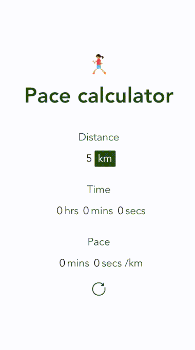

# vue-calculator

## Description

A simple distance/speed/time calculator. No need to specify which value you're trying to calculate - it looks at the last two inputs and automatically calculates the value for the third, minimising clicks 🥳

It's a PWA so can be added to homescreen and works offline: http://vue-pace-calculator.web.app/

## Demo


## Project setup
```
yarn install
```

### Compiles and hot-reloads for development
```
yarn start
```

### Compiles and minifies for production
```
yarn build
```

### Lints and fixes files
```
yarn lint
```

### Firebase deployment
```
yarn build
firebase serve (optional - check changes)
firebase deploy -m [DEPLOY-MESSAGE]
```

### Customize configuration
See [Configuration Reference](https://cli.vuejs.org/config/).
